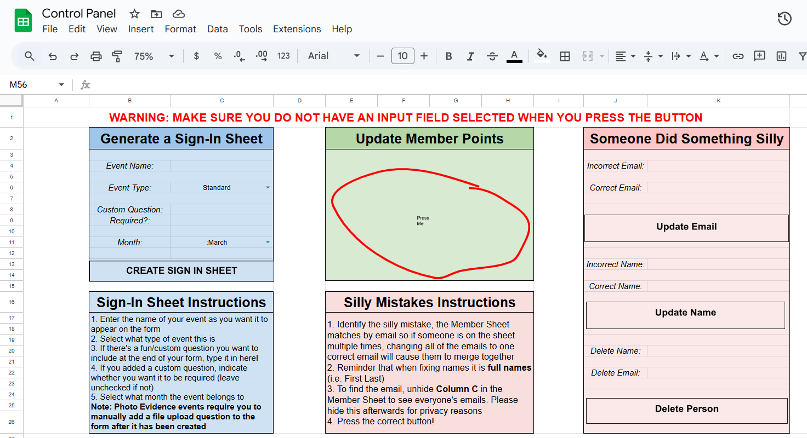
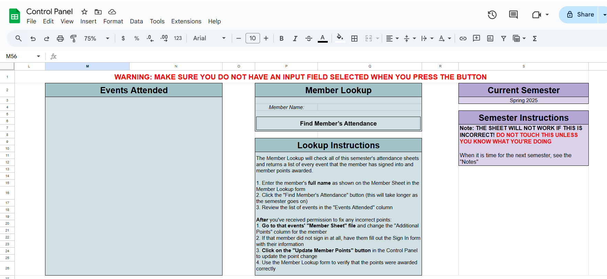
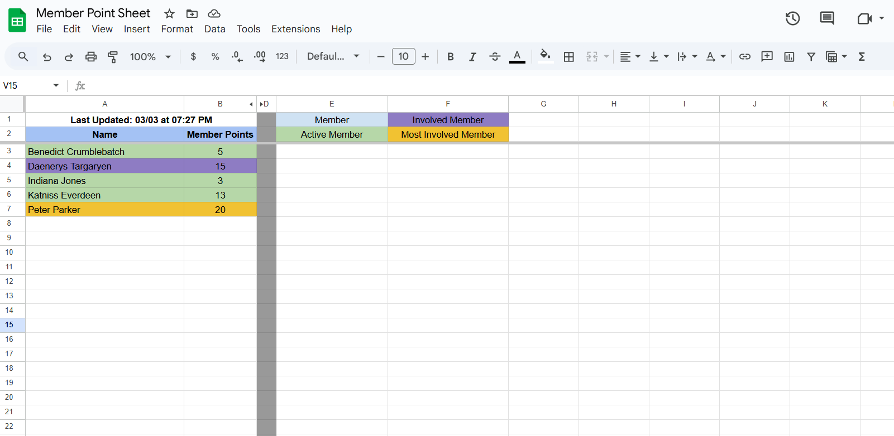
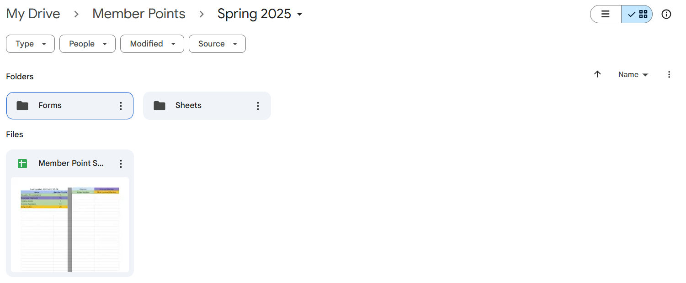
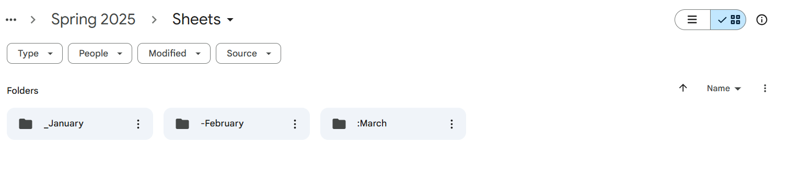

# Member Attendance Tracking System

## Description
This system is designed for tracking member attendance and points within a structured Google Drive folder. It provides an easy-to-use Google Sheets interface to manage attendance, generate reports, and update member records efficiently.

## Features
### Control Panel: A centralized Google Sheet where users can:
- Generate different types of sign-in forms (Standard, Fundraising, and Photo Evidence Events).
- Update the overall point values displayed in the "Member Points" Google Sheet.
- Modify member names and emails.
- Remove members from all events.
- Retrieve individual member attendance records.
- Member Points Sheet: Tracks attendance points across different events and time periods.

### Organized Structure: 
The system is categorized by time periods (semesters, quarters, etc.), which are further divided into months for detailed tracking.

### System Structure
The system operates within a Google Drive folder and consists of:
- **Control Panel Google Sheet:** The main interface for managing attendance and points.
- **Member Points Sheet:** Stores attendance and point values.
- **Event-Specific Folders:** Contain generated sign-in forms and attendance records.
- **Automated Processing:** Uses Google Apps Script to handle data updates and automation.

## Screenshots
### Control Panel
 
### Member Points Sheet

### Google Drive Structure

## How It Works
1. Users access the Control Panel to generate sign-in forms and manage attendance.
2. Members complete the sign-in forms for different events.
3. Attendance data is automatically logged and updates the Member Points Sheet.
4. Users can view attendance records and point totals in real time.
   
## Installation & Setup
1. Copy the provided Google Sheets templates into your Google Drive.
2. Set up the necessary Google Apps Scripts for automation.
3. Organize your Drive folders according to the time periods and events.
4. Set up a daily trigger:
  - Open the Google Apps Script editor from your Control Panel Sheet.
  - Navigate to Triggers > Add Trigger.
  - Choose the function that updates member points.
  - Set the event type to "Time-driven" and configure it to run daily at your preferred time.
5. Begin using the Control Panel to track and manage attendance.

### [Link to Example Google Drive](https://drive.google.com/drive/folders/17yo2PWSct377HT6DIZILLvyOyuBn3VNr?usp=sharing)
